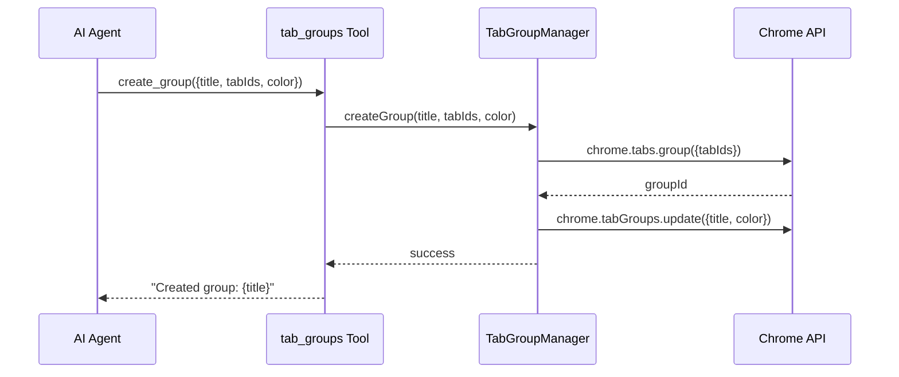

# S10: Tab Groups - Design

## Architecture



## Implementation

```typescript
// src/lib/tab-groups.ts
interface TabGroup {
  id: number;
  title: string;
  color: chrome.tabGroups.ColorEnum;
  collapsed: boolean;
  tabIds: number[];
}

class TabGroupManager {
  async createGroup(title: string, tabIds: number[], color?: string): Promise<number> {
    const groupId = await chrome.tabs.group({ tabIds });
    await chrome.tabGroups.update(groupId, { 
      title, 
      color: (color || 'blue') as chrome.tabGroups.ColorEnum 
    });
    return groupId;
  }
  
  async updateGroup(groupId: number, options: { 
    title?: string; 
    color?: string; 
    collapsed?: boolean 
  }): Promise<void> {
    await chrome.tabGroups.update(groupId, options as any);
  }
  
  async ungroupTabs(tabIds: number[]): Promise<void> {
    await chrome.tabs.ungroup(tabIds);
  }
  
  async listGroups(windowId?: number): Promise<TabGroup[]> {
    const groups = await chrome.tabGroups.query({ windowId });
    return Promise.all(groups.map(async g => {
      const tabs = await chrome.tabs.query({ groupId: g.id });
      return { 
        id: g.id,
        title: g.title || '',
        color: g.color,
        collapsed: g.collapsed,
        tabIds: tabs.map(t => t.id!).filter(Boolean)
      };
    }));
  }
}

export const tabGroupManager = new TabGroupManager();
```

## Tool Definition

```typescript
// src/tools/tab-groups.ts
export const tabGroupsTool: ToolDefinition = {
  name: 'tab_groups',
  description: 'Manage Chrome tab groups: create, update, ungroup, list',
  parameters: {
    action: { 
      type: 'string', 
      enum: ['create', 'update', 'ungroup', 'list'],
      required: true 
    },
    title: { type: 'string', description: 'Group title' },
    tab_ids: { type: 'array', description: 'Tab IDs to group' },
    group_id: { type: 'number', description: 'Group ID for update/ungroup' },
    color: { type: 'string', enum: ['grey', 'blue', 'red', 'yellow', 'green', 'pink', 'purple', 'cyan', 'orange'] },
    collapsed: { type: 'boolean', description: 'Collapse group' }
  },
  execute: async (input, context) => {
    const { action, title, tab_ids, group_id, color, collapsed } = input;
    
    switch (action) {
      case 'create':
        const id = await tabGroupManager.createGroup(title, tab_ids, color);
        return { output: `Created group "${title}" with ID ${id}` };
      case 'update':
        await tabGroupManager.updateGroup(group_id, { title, color, collapsed });
        return { output: `Updated group ${group_id}` };
      case 'ungroup':
        await tabGroupManager.ungroupTabs(tab_ids);
        return { output: `Ungrouped ${tab_ids.length} tabs` };
      case 'list':
        const groups = await tabGroupManager.listGroups();
        return { output: JSON.stringify(groups, null, 2) };
    }
  },
  toAnthropicSchema: () => ({ /* ... */ })
};
```
