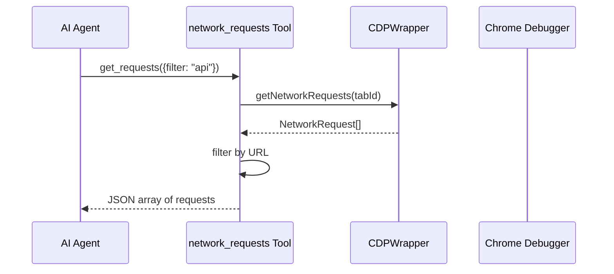

# S11: Network & Console Tracking - Design

## Architecture

The CDP Wrapper (S05) already implements network and console tracking.
These tools expose that data to the AI.



## Tool Implementations

```typescript
// src/tools/network.ts
export const networkTool: ToolDefinition = {
  name: 'network_requests',
  description: 'Get recent network requests from the current tab',
  parameters: {
    filter: { type: 'string', description: 'Optional URL substring filter' }
  },
  execute: async (input, context) => {
    // Ensure tracking is enabled
    await cdpWrapper.enableNetworkTracking(context.tabId);
    
    const requests = cdpWrapper.getNetworkRequests(context.tabId);
    const filtered = input.filter 
      ? requests.filter(r => r.url.includes(input.filter))
      : requests;
    
    return { output: JSON.stringify(filtered, null, 2) };
  }
};

// src/tools/console.ts
export const consoleTool: ToolDefinition = {
  name: 'console_logs',
  description: 'Get console logs from the current tab',
  parameters: {
    type: { 
      type: 'string', 
      enum: ['log', 'warn', 'error', 'all'],
      description: 'Filter by log type' 
    }
  },
  execute: async (input, context) => {
    await cdpWrapper.enableConsoleTracking(context.tabId);
    
    const logs = cdpWrapper.getConsoleLogs(context.tabId);
    const filtered = input.type && input.type !== 'all'
      ? logs.filter(l => l.type === input.type)
      : logs;
    
    return { output: JSON.stringify(filtered, null, 2) };
  }
};
```
