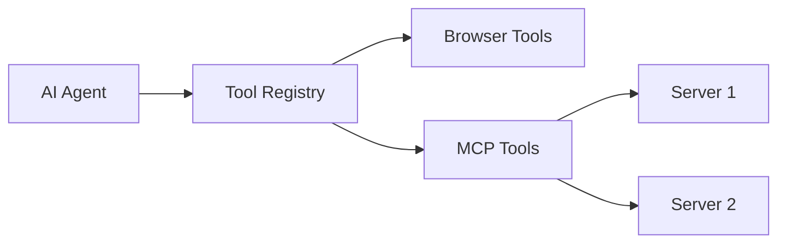

# S13: MCP Integration - Design

## Architecture



## Tool Naming Convention

```typescript
// Tool names follow pattern: mcp__<uuid>__<toolname>
// Example: mcp__a1b2c3d4-e5f6-7890-abcd-ef1234567890__read_file

const MCP_TOOL_PATTERN = /^mcp__([0-9a-f-]+)__(.+)$/;

export function formatMcpToolName(uuid: string, toolName: string): string {
  return `mcp__${uuid}__${toolName}`;
}

export function parseMcpToolName(fullName: string): { uuid: string; name: string } | null {
  const match = fullName.match(MCP_TOOL_PATTERN);
  return match ? { uuid: match[1], name: match[2] } : null;
}

export function isMcpTool(toolName: string): boolean {
  return MCP_TOOL_PATTERN.test(toolName);
}
```

## MCP Types

```typescript
// src/lib/mcp.ts
interface MCPServer {
  uuid: string;
  name: string;
  url: string;
  status: 'connected' | 'disconnected' | 'error';
  lastConnected?: number;
}

interface MCPTool {
  name: string;
  displayName?: string;
  description: string;
  inputSchema: object;
  alwaysApprovedKey?: string;
}
```

## MCP Store

```typescript
// src/stores/mcp.ts
interface MCPState {
  servers: MCPServer[];
  toolsByServer: Record<string, MCPTool[]>;
  enabledTools: Record<string, boolean>;  // Full tool name -> enabled
  
  addServer(url: string, name: string): Promise<MCPServer>;
  removeServer(uuid: string): void;
  refreshTools(uuid: string): Promise<void>;
  setToolEnabled(fullName: string, enabled: boolean): void;
  getEnabledMcpTools(): ToolDefinition[];
}
```

## MCP Client

```typescript
class MCPClient {
  async connect(url: string): Promise<MCPTool[]> {
    const response = await fetch(`${url}/tools/list`);
    const { tools } = await response.json();
    return tools;
  }
  
  async callTool(url: string, toolName: string, input: object): Promise<any> {
    const response = await fetch(`${url}/tools/call`, {
      method: 'POST',
      headers: { 'Content-Type': 'application/json' },
      body: JSON.stringify({ name: toolName, arguments: input })
    });
    return response.json();
  }
}
```
