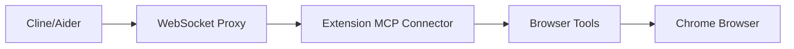

# S14: MCP Connector - Design

## Architecture

**INNOVATION**: Expose browser tools to external LLMs!



## Implementation Approach

Chrome extensions cannot directly create WebSocket servers. 
Solution: Use a companion proxy or native messaging.

### Option A: Native Messaging Proxy (Recommended)
```
External LLM → Native Host (Node.js) → Extension
```

### Option B: HTTP Polling via Content Script
```
External LLM → localhost:54321 → iframe → Content Script → Extension
```

## MCP Connector

```typescript
// src/lib/mcp-connector.ts

interface MCPConnectorConfig {
  enabled: boolean;
  port: number;
  authToken: string;
  exposedTools: string[];
}

class MCPConnector {
  private config: MCPConnectorConfig;
  
  // MCP Protocol handlers
  handleToolsList(): { tools: AnthropicToolSchema[] } {
    const allTools = getAllTools();
    const exposed = allTools.filter(t => 
      this.config.exposedTools.includes(t.name)
    );
    return { tools: exposed.map(t => t.toAnthropicSchema()) };
  }
  
  async handleToolCall(name: string, input: object): Promise<ToolResult> {
    const context = await this.getActiveTabContext();
    return executeTool(name, input, context);
  }
  
  private async getActiveTabContext(): Promise<ToolContext> {
    const [tab] = await chrome.tabs.query({ active: true, currentWindow: true });
    return {
      tabId: tab.id!,
      url: tab.url || '',
      permissionManager: /* ... */
    };
  }
}
```

## Settings UI

```tsx
function MCPConnectorSettings() {
  return (
    <Card>
      <CardHeader>
        <CardTitle>MCP Connector</CardTitle>
        <CardDescription>
          Allow external tools to use browser automation
        </CardDescription>
      </CardHeader>
      <CardContent>
        <Alert>
          <AlertDescription>
            Connect from Cline/Aider to use browser tools.
            Requires companion proxy (see docs).
          </AlertDescription>
        </Alert>
        <div className="space-y-4">
          <Switch label="Enable MCP Connector" />
          <div>
            <Label>Exposed Tools</Label>
            {getAllTools().map(tool => (
              <Checkbox key={tool.name} label={tool.name} />
            ))}
          </div>
        </div>
      </CardContent>
    </Card>
  );
}
```
