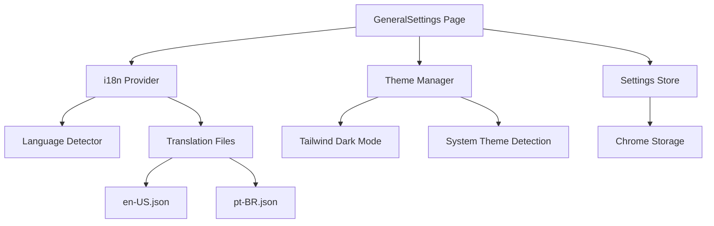

# S16: General Settings & Localization - Design Document

## Overview

This design implements a centralized General Settings page for application-wide preferences, starting with Internationalization (i18n) and Theme management. The implementation enables users to customize their experience with language selection and theme preferences.

## Architecture

### High-Level Components



### Component Hierarchy

```
src/
├── lib/
│   ├── i18n.ts                    # i18next configuration
│   └── theme.ts                   # Theme utilities (existing)
├── stores/
│   └── settings.ts                # General settings Zustand store
├── locales/
│   ├── en.json                    # English translations
│   └── pt.json                    # Portuguese translations
├── sidepanel/
│   └── pages/
│       └── GeneralSettings.tsx    # Main settings page
└── components/
    └── settings/
        ├── LanguageSelector.tsx   # Language dropdown
        └── ThemeSelector.tsx      # Theme toggle
```

## Detailed Design

### 1. Internationalization Infrastructure

#### i18n Configuration (src/lib/i18n.ts)


```typescript
import i18n from 'i18next';
import { initReactI18next } from 'react-i18next';
import LanguageDetector from 'i18next-browser-languagedetector';

// Import translation files
import enTranslations from '@/locales/en.json';
import ptTranslations from '@/locales/pt.json';

i18n
  .use(LanguageDetector) // Detect browser language
  .use(initReactI18next) // React integration
  .init({
    resources: {
      en: { translation: enTranslations },
      pt: { translation: ptTranslations }
    },
    fallbackLng: 'en',
    interpolation: {
      escapeValue: false // React already escapes
    },
    detection: {
      order: ['localStorage', 'navigator'],
      caches: ['localStorage']
    }
  });

export default i18n;
```

**Key Features**:
- Auto-detection from browser settings
- Fallback to English if language not supported
- Persistence via localStorage
- React integration via hooks

#### Translation File Structure (locales/en.json)

```json
{
  "common": {
    "save": "Save",
    "cancel": "Cancel",
    "reset": "Reset to Defaults",
    "confirm": "Confirm"
  },
  "settings": {
    "title": "General Settings",
    "language": {
      "label": "Language",
      "description": "Choose your preferred language"
    },
    "theme": {
      "label": "Theme",
      "description": "Choose your color theme",
      "system": "System Default",
      "light": "Light",
      "dark": "Dark"
    },
    "version": "Version {{version}}"
  },
  "chat": {
    "placeholder": "Type a message...",
    "send": "Send",
    "clear": "Clear Chat"
  },
  "providers": {
    "title": "Provider Settings",
    "addProvider": "Add Provider",
    "noProviders": "No providers configured"
  }
}
```

**Namespacing Strategy**:
- `common`: Shared UI strings
- `settings`: Settings page strings
- `chat`: Chat interface strings
- `providers`: Provider management strings
- Additional namespaces per feature

### 2. Settings Store (src/stores/settings.ts)

```typescript
import { create } from 'zustand';
import { persist } from 'zustand/middleware';

interface SettingsState {
  language: string;
  theme: 'system' | 'light' | 'dark';
  
  // Actions
  setLanguage: (language: string) => void;
  setTheme: (theme: 'system' | 'light' | 'dark') => void;
  resetToDefaults: () => void;
}

const DEFAULT_SETTINGS = {
  language: 'en',
  theme: 'system' as const
};

export const useSettingsStore = create<SettingsState>()(
  persist(
    (set) => ({
      ...DEFAULT_SETTINGS,
      
      setLanguage: (language) => {
        set({ language });
        // Update i18n
        import('@/lib/i18n').then(({ default: i18n }) => {
          i18n.changeLanguage(language);
        });
      },
      
      setTheme: (theme) => {
        set({ theme });
        // Apply theme immediately
        applyTheme(theme);
      },
      
      resetToDefaults: () => {
        set(DEFAULT_SETTINGS);
        applyTheme(DEFAULT_SETTINGS.theme);
      }
    }),
    {
      name: 'sidepilot-settings',
      storage: {
        getItem: async (name) => {
          const result = await chrome.storage.local.get(name);
          return result[name] ? JSON.parse(result[name]) : null;
        },
        setItem: async (name, value) => {
          await chrome.storage.local.set({ [name]: JSON.stringify(value) });
        },
        removeItem: async (name) => {
          await chrome.storage.local.remove(name);
        }
      }
    }
  )
);

function applyTheme(theme: 'system' | 'light' | 'dark') {
  const root = document.documentElement;
  
  if (theme === 'system') {
    const prefersDark = window.matchMedia('(prefers-color-scheme: dark)').matches;
    root.classList.toggle('dark', prefersDark);
  } else {
    root.classList.toggle('dark', theme === 'dark');
  }
}
```

### 3. General Settings UI (src/sidepanel/pages/GeneralSettings.tsx)

```typescript
import { useTranslation } from 'react-i18next';
import { useSettingsStore } from '@/stores/settings';
import { Card, CardContent, CardDescription, CardHeader, CardTitle } from '@/components/ui/card';
import { Select, SelectContent, SelectItem, SelectTrigger, SelectValue } from '@/components/ui/select';
import { Button } from '@/components/ui/button';
import { Label } from '@/components/ui/label';
import { AlertDialog, AlertDialogAction, AlertDialogCancel, AlertDialogContent, 
         AlertDialogDescription, AlertDialogFooter, AlertDialogHeader, 
         AlertDialogTitle, AlertDialogTrigger } from '@/components/ui/alert-dialog';
import { HugeiconsIcon } from '@hugeicons/react';
import { Globe01Icon, PaintBoardIcon, RefreshIcon } from '@hugeicons/core-free-icons';

export function GeneralSettings() {
  const { t, i18n } = useTranslation();
  const { language, theme, setLanguage, setTheme, resetToDefaults } = useSettingsStore();
  
  const version = chrome.runtime.getManifest().version;
  
  return (
    <div className="space-y-6 p-6">
      <div>
        <h1 className="text-2xl font-semibold">{t('settings.title')}</h1>
        <p className="text-sm text-muted-foreground mt-1">
          {t('settings.version', { version })}
        </p>
      </div>
      
      {/* Language Settings */}
      <Card>
        <CardHeader>
          <CardTitle className="flex items-center gap-2">
            <HugeiconsIcon icon={Globe01Icon} className="h-5 w-5" />
            {t('settings.language.label')}
          </CardTitle>
          <CardDescription>
            {t('settings.language.description')}
          </CardDescription>
        </CardHeader>
        <CardContent>
          <div className="space-y-2">
            <Label htmlFor="language">Language</Label>
            <Select value={language} onValueChange={setLanguage}>
              <SelectTrigger id="language">
                <SelectValue />
              </SelectTrigger>
              <SelectContent>
                <SelectItem value="en">English (US)</SelectItem>
                <SelectItem value="pt">Português (BR)</SelectItem>
              </SelectContent>
            </Select>
          </div>
        </CardContent>
      </Card>
      
      {/* Theme Settings */}
      <Card>
        <CardHeader>
          <CardTitle className="flex items-center gap-2">
            <HugeiconsIcon icon={PaintBoardIcon} className="h-5 w-5" />
            {t('settings.theme.label')}
          </CardTitle>
          <CardDescription>
            {t('settings.theme.description')}
          </CardDescription>
        </CardHeader>
        <CardContent>
          <div className="space-y-2">
            <Label htmlFor="theme">Theme</Label>
            <Select value={theme} onValueChange={(v) => setTheme(v as any)}>
              <SelectTrigger id="theme">
                <SelectValue />
              </SelectTrigger>
              <SelectContent>
                <SelectItem value="system">{t('settings.theme.system')}</SelectItem>
                <SelectItem value="light">{t('settings.theme.light')}</SelectItem>
                <SelectItem value="dark">{t('settings.theme.dark')}</SelectItem>
              </SelectContent>
            </Select>
          </div>
        </CardContent>
      </Card>
      
      {/* Reset Button */}
      <AlertDialog>
        <AlertDialogTrigger asChild>
          <Button variant="outline" className="w-full">
            <HugeiconsIcon icon={RefreshIcon} className="h-4 w-4 mr-2" />
            {t('common.reset')}
          </Button>
        </AlertDialogTrigger>
        <AlertDialogContent>
          <AlertDialogHeader>
            <AlertDialogTitle>Reset to Defaults?</AlertDialogTitle>
            <AlertDialogDescription>
              This will reset all general settings to their default values.
            </AlertDialogDescription>
          </AlertDialogHeader>
          <AlertDialogFooter>
            <AlertDialogCancel>{t('common.cancel')}</AlertDialogCancel>
            <AlertDialogAction onClick={resetToDefaults}>
              {t('common.confirm')}
            </AlertDialogAction>
          </AlertDialogFooter>
        </AlertDialogContent>
      </AlertDialog>
    </div>
  );
}
```

### 4. Theme System Integration

The theme system builds on the existing `src/lib/theme.ts` utility:

```typescript
// Enhanced theme.ts
export type Theme = 'system' | 'light' | 'dark';

export function applyTheme(theme: Theme) {
  const root = document.documentElement;
  
  if (theme === 'system') {
    const prefersDark = window.matchMedia('(prefers-color-scheme: dark)').matches;
    root.classList.toggle('dark', prefersDark);
  } else {
    root.classList.toggle('dark', theme === 'dark');
  }
}

export function watchSystemTheme(callback: (isDark: boolean) => void) {
  const mediaQuery = window.matchMedia('(prefers-color-scheme: dark)');
  
  const handler = (e: MediaQueryListEvent) => callback(e.matches);
  mediaQuery.addEventListener('change', handler);
  
  return () => mediaQuery.removeEventListener('change', handler);
}
```

**Tailwind Configuration** (already configured):
```javascript
// tailwind.config.js
module.exports = {
  darkMode: 'class', // Uses .dark class on root element
  // ... rest of config
}
```

### 5. String Migration Strategy

**Phase 1: Core Components** (Priority)
- Settings pages
- Chat interface
- Provider management
- Error messages

**Phase 2: Secondary Components**
- Tool descriptions
- Permission dialogs
- Workflow editor

**Migration Pattern**:
```typescript
// Before
<Button>Save</Button>

// After
import { useTranslation } from 'react-i18next';

function MyComponent() {
  const { t } = useTranslation();
  return <Button>{t('common.save')}</Button>;
}
```

## Data Models

### Settings State
```typescript
interface GeneralSettings {
  language: string;        // ISO 639-1 code (en, pt)
  theme: Theme;           // 'system' | 'light' | 'dark'
}
```

### Translation Structure
```typescript
interface TranslationNamespace {
  [key: string]: string | TranslationNamespace;
}

interface Translations {
  common: TranslationNamespace;
  settings: TranslationNamespace;
  chat: TranslationNamespace;
  providers: TranslationNamespace;
  // ... more namespaces
}
```

## Dependencies

### New Dependencies
```json
{
  "i18next": "^23.7.0",
  "react-i18next": "^14.0.0",
  "i18next-browser-languagedetector": "^7.2.0"
}
```

### Existing Dependencies (Reused)
- Zustand (state management)
- Chrome Storage API (persistence)
- shadcn/ui components (UI)
- Tailwind CSS (theming)

## Testing Strategy

### Unit Tests
1. **i18n Configuration**
   - Language detection works
   - Fallback to English
   - Translation key resolution

2. **Settings Store**
   - Language change updates i18n
   - Theme change applies immediately
   - Reset to defaults works
   - Chrome storage persistence

3. **Theme System**
   - System theme detection
   - Manual theme override
   - Dark mode class application

### Integration Tests
1. **Settings UI**
   - Language selector updates store and UI
   - Theme selector applies theme immediately
   - Reset button shows confirmation dialog
   - Version info displays correctly

2. **String Migration**
   - All UI strings use translation keys
   - No hardcoded strings in components
   - Portuguese translations complete

## Implementation Notes

### Language Detection Priority
1. User's explicit selection (localStorage)
2. Browser language (navigator.language)
3. Fallback to English

### Theme Application
- Theme changes apply immediately (no page reload)
- System theme respects OS preference
- Manual theme overrides system preference
- Theme persists across sessions

### Translation Key Naming
- Use dot notation: `namespace.category.key`
- Keep keys descriptive: `settings.language.description`
- Group related keys: `chat.placeholder`, `chat.send`

### Future Enhancements
- Additional languages (es, fr, de, etc.)
- Right-to-left (RTL) language support
- Custom theme colors
- Font size preferences
- Accessibility settings

## Requirements Mapping

| Requirement | Implementation |
|-------------|----------------|
| AC1: i18n Support | i18next with en-US and pt-BR translations |
| AC1: Auto-detect | i18next-browser-languagedetector |
| AC1: Persist | Chrome storage via Zustand persist |
| AC1: No hardcoded strings | useTranslation hook in all components |
| AC2: Theme options | System/Light/Dark selector |
| AC2: Immediate application | applyTheme function with class toggle |
| AC2: Persist theme | Chrome storage via Zustand persist |

## Success Criteria

- ✅ Users can switch between English and Portuguese
- ✅ Language preference persists across sessions
- ✅ Browser language auto-detected on first load
- ✅ No hardcoded strings in UI components
- ✅ Theme selector with System/Light/Dark options
- ✅ Theme changes apply immediately without reload
- ✅ Theme preference persists across sessions
- ✅ Reset to defaults button with confirmation
- ✅ Version info displayed in settings
