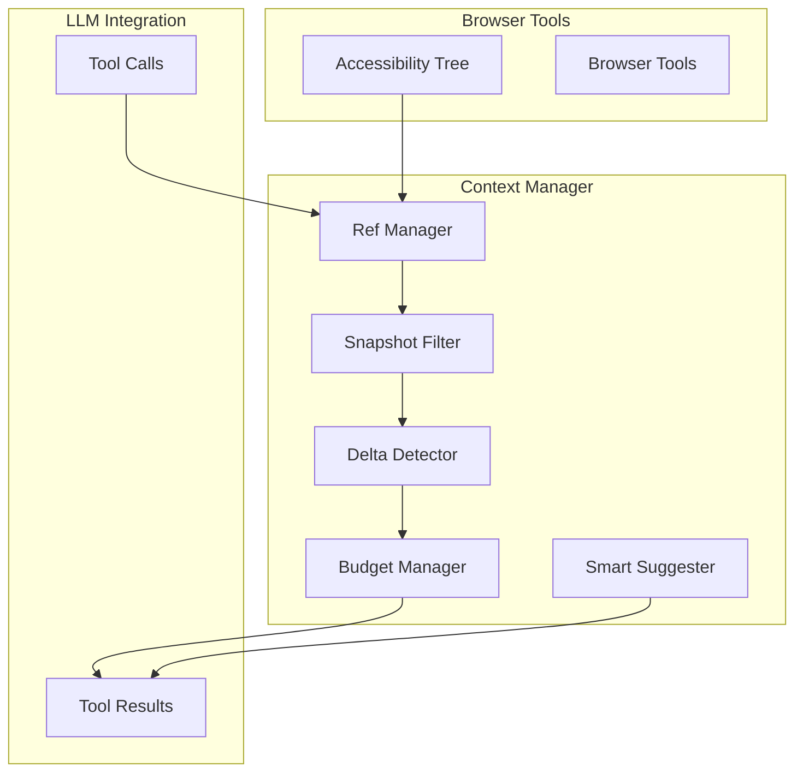

# S18: Context Optimization & Smart Navigation - Design

## Architecture Overview



---

## Module Design

### 1. Ref Manager (`src/lib/context/ref-manager.ts`)

Assigns short, deterministic refs to DOM elements for minimal-token targeting.

```typescript
interface RefMap {
  refToElement: Map<string, WeakRef<Element>>;
  elementToRef: WeakMap<Element, string>;
  pageId: string;  // Invalidates on navigation
}

interface RefManagerOptions {
  prefix?: string;           // Default: 'e'
  persistAcrossNavigation?: boolean;  // Default: false
}

class RefManager {
  private refs: RefMap;
  private counter: number = 0;
  
  // Assign refs to all interactive elements
  assignRefs(root: Element, filter?: SnapshotFilter): RefAssignment[];
  
  // Resolve ref to element
  resolve(ref: string): Element | null;
  
  // Get ref for element (create if needed)
  getOrCreateRef(element: Element): string;
  
  // Clear all refs (on navigation)
  clear(): void;
  
  // Get all current refs with metadata
  getRefMap(): Record<string, RefMetadata>;
}

interface RefMetadata {
  ref: string;
  role: string;
  name?: string;
  tagName: string;
  interactable: boolean;
}
```

**Ref Format:**
- Short: `e1`, `e2`, `e3`... (single character prefix + number)
- Deterministic: Same DOM structure → same refs
- Tool input format: `@e1`, `@e27`

### 2. Snapshot Filter (`src/lib/context/snapshot-filter.ts`)

Configurable filtering to reduce accessibility tree output.

```typescript
interface SnapshotFilterOptions {
  interactive?: boolean;     // Only interactive elements (buttons, links, inputs)
  depth?: number;           // Max tree depth (default: unlimited)
  scope?: string;           // CSS selector to scope snapshot
  compact?: boolean;        // Remove empty/structural nodes
  includeRefs?: boolean;    // Include ref annotations (default: true)
  maxElements?: number;     // Hard limit on elements returned
}

// Role whitelist for interactive filter
const INTERACTIVE_ROLES = [
  'button', 'link', 'textbox', 'checkbox', 'radio', 
  'combobox', 'listbox', 'menuitem', 'tab', 'slider',
  'searchbox', 'spinbutton', 'switch'
];

// Tags that are always interactive
const INTERACTIVE_TAGS = [
  'a', 'button', 'input', 'select', 'textarea', 
  'details', 'summary'
];

class SnapshotFilter {
  constructor(options: SnapshotFilterOptions);
  
  // Filter accessibility tree
  filter(tree: AccessibilityNode): FilteredSnapshot;
  
  // Estimate token reduction
  estimateReduction(original: AccessibilityNode): number;
}

interface FilteredSnapshot {
  tree: string;              // Filtered accessibility tree
  refs: Record<string, RefMetadata>;  // Ref map
  stats: {
    originalNodes: number;
    filteredNodes: number;
    reduction: number;      // Percentage
  };
}
```

**Output Format:**
```
- heading "Welcome" [ref=e1]
- button "Sign In" [ref=e2]
- textbox "Email" [ref=e3]
- textbox "Password" [ref=e4] [type=password]
- button "Submit" [ref=e5]
- link "Forgot Password?" [ref=e6]
```

### 3. Delta Detector (`src/lib/context/delta-detector.ts`)

Tracks DOM changes and provides incremental updates.

```typescript
interface DeltaState {
  hash: string;
  timestamp: number;
  refs: Record<string, RefMetadata>;
  snapshot: string;
}

interface DeltaResult {
  type: 'full' | 'delta' | 'unchanged';
  content?: string;
  changes?: {
    added: RefMetadata[];
    removed: string[];      // Removed ref IDs
    modified: RefMetadata[];
  };
  hash: string;
}

class DeltaDetector {
  private lastState: DeltaState | null = null;
  
  // Compute hash of accessibility tree section
  computeHash(node: AccessibilityNode): string;
  
  // Check if state changed and return delta
  detectChanges(current: FilteredSnapshot): DeltaResult;
  
  // Force full snapshot on next call
  invalidate(): void;
  
  // Get last known state
  getLastState(): DeltaState | null;
}
```

**Delta Output Format:**
```
[DELTA since 1705500000]
+ button "New Button" [ref=e7]
~ textbox "Email" [ref=e3] → value changed
- button "Old Button" [was ref=e8]
```

### 4. Budget Manager (`src/lib/context/budget-manager.ts`)

Tracks context token usage and triggers compression.

```typescript
interface BudgetOptions {
  maxTokens: number;         // Total context budget
  warningThreshold: number;  // Warn at this % (default: 70)
  compressionThreshold: number;  // Auto-compress at this % (default: 85)
  onWarning?: (usage: BudgetUsage) => void;
}

interface BudgetUsage {
  used: number;
  remaining: number;
  percentage: number;
  breakdown: {
    systemPrompt: number;
    conversation: number;
    toolResults: number;
  };
}

type CompressionLevel = 'none' | 'interactive' | 'clickable' | 'summary';

class BudgetManager {
  constructor(options: BudgetOptions);
  
  // Estimate tokens in text
  estimateTokens(text: string): number;
  
  // Track token usage
  track(category: string, tokens: number): void;
  
  // Get current usage
  getUsage(): BudgetUsage;
  
  // Determine required compression level
  getCompressionLevel(): CompressionLevel;
  
  // Reset tracking (new conversation)
  reset(): void;
}
```

**Token Estimation:**
```typescript
// Simple estimation: ~4 chars per token for English
const CHARS_PER_TOKEN = 4;

function estimateTokens(text: string): number {
  return Math.ceil(text.length / CHARS_PER_TOKEN);
}
```

### 5. Smart Suggester (`src/lib/context/smart-suggester.ts`)

Analyzes page structure and suggests relevant actions.

```typescript
interface PageAnalysis {
  type: 'form' | 'list' | 'article' | 'dashboard' | 'login' | 'search' | 'unknown';
  confidence: number;
  suggestedActions: SuggestedAction[];
}

interface SuggestedAction {
  action: string;           // e.g., "fill", "click", "scroll"
  target?: string;          // Ref or description
  description: string;      // Human-readable
  priority: number;         // 1-10
}

class SmartSuggester {
  // Analyze page and suggest actions
  analyze(snapshot: FilteredSnapshot): PageAnalysis;
  
  // Detect common page patterns
  private detectPageType(refs: RefMetadata[]): string;
  
  // Generate action suggestions
  private generateSuggestions(type: string, refs: RefMetadata[]): SuggestedAction[];
}

// Page type indicators
const PAGE_PATTERNS = {
  login: ['password', 'sign in', 'log in', 'username', 'email'],
  form: ['submit', 'save', 'continue', 'next'],
  search: ['search', 'filter', 'find'],
  list: ['showing', 'results', 'items per page', 'next page'],
};
```

**Suggestion Output:**
```
[PAGE TYPE: login (confidence: 0.92)]
Suggested actions:
1. fill @e3 (Email field)
2. fill @e4 (Password field)  
3. click @e5 (Submit button)
```

---

## Tool Integration

### Updated `get_page_content` Tool

```typescript
interface GetPageContentParams {
  // Existing
  includeLinks?: boolean;
  
  // NEW: Filtering options
  interactive?: boolean;    // AC2.1
  depth?: number;          // AC2.2
  scope?: string;          // AC2.3
  compact?: boolean;       // AC2.4
  
  // NEW: Delta mode
  delta?: boolean;         // Only return changes
  
  // NEW: Output options
  includeRefs?: boolean;   // Include ref annotations (default: true)
  includeSuggestions?: boolean;  // Include smart suggestions
}
```

### Updated Tool Selector Resolution

All tools accept refs in selector fields:

```typescript
// In browser-tools.ts click implementation
async function click(selector: string): Promise<ToolResult> {
  let element: Element;
  
  if (selector.startsWith('@')) {
    // Resolve ref
    const ref = selector.slice(1);
    element = refManager.resolve(ref);
    if (!element) {
      return { success: false, error: `Ref ${ref} not found or stale` };
    }
  } else {
    // Traditional selector
    element = document.querySelector(selector);
  }
  
  // ... proceed with click
}
```

---

## Data Flow

### Optimal AI Workflow

```
1. Navigate to page
   └─ agent-browser open https://example.com

2. Get filtered snapshot with refs
   └─ get_page_content --interactive --refs
   └─ Returns: 
      - heading "Example" [ref=e1]
      - button "Login" [ref=e2]
      - textbox "Email" [ref=e3]
      [PAGE TYPE: login]
      Suggestions: fill @e3, click @e2

3. AI executes with refs (minimal tokens)
   └─ click @e2
   └─ fill @e3 "user@test.com"

4. Request delta on interaction
   └─ get_page_content --delta
   └─ Returns: [DELTA] ~ textbox @e3 value changed

5. Continue until done
```

---

## File Structure

```
src/lib/context/
├── types.ts                 # All type definitions
├── ref-manager.ts           # Ref assignment and resolution
├── snapshot-filter.ts       # Tree filtering
├── delta-detector.ts        # Change detection
├── budget-manager.ts        # Token tracking
├── smart-suggester.ts       # Action suggestions
├── index.ts                 # Public exports
└── __tests__/
    ├── ref-manager.test.ts
    ├── snapshot-filter.test.ts
    ├── delta-detector.test.ts
    └── budget-manager.test.ts

src/tools/
├── accessibility.ts         # Updated with ref support
├── browser-tools.ts         # Updated to accept refs
└── page-content.ts          # New filtering options
```

---

## Performance Budgets

| Operation | Target | Maximum |
|-----------|--------|---------|
| Ref resolution | 2ms | 5ms |
| Snapshot filtering | 10ms | 50ms |
| Delta detection | 5ms | 20ms |
| Token estimation | 1ms | 5ms |
| Smart suggestions | 10ms | 30ms |

---

## Testing Strategy

### Unit Tests
- Ref assignment determinism
- Filter accuracy (interactive-only, depth limit)
- Delta detection correctness
- Token estimation accuracy

### Integration Tests
- End-to-end ref workflow
- Tool call with refs
- Budget warning triggers
- Smart suggestions accuracy

### Performance Tests
- 1000+ element pages
- Rapid DOM mutations
- Memory usage under load
